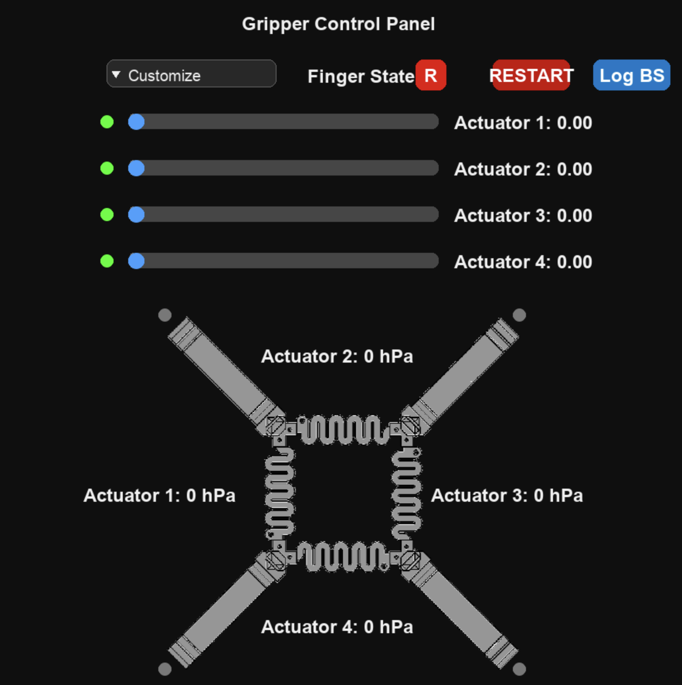

# Whole-Body Proprioceptive Morphing: A Modular Soft Gripper for Robust Cross-Scale Grasping

Official code repository for the paper:  
**"Whole-Body Proprioceptive Morphing: A Modular Soft Gripper for Robust Cross-Scale Grasping"**

## Authors

**Dong Heon Han¹, Xiaohao Xu²†, Yuxi Chen¹, Yusheng Zhou², Xinqi Zhang¹, Jiaqi Wang², Daniel Bruder¹, Xiaonan Huang²***  

¹ *Mechanical Engineering Department, University of Michigan – Ann Arbor, Ann Arbor, MI, USA*  
² *Robotics Department, University of Michigan – Ann Arbor, Ann Arbor, MI, USA*  

† *Project Lead* | * Corresponding Author  

**Emails:**  
- (dongheon, ethansab, dadaaa, dbruder)@umich.edu
- (xiaohaox, yszhou, wangjq, xiaonanh)@umich.edu

## Overview
This repository provides the control and communication code for the modular soft gripper system described in the paper.
The system integrates Arduino-based low-level actuation and a Python control interface for proprioceptive feedback and grasp modulation.

## Repository Structure
```bash
main/
├── Gripper_FullCode/
│   └── Gripper_FullCode.ino        # Firmware controlling the modular soft gripper
├── GripperControl.py               # Main Python UI and control logic
├── serial_controller.py            # Handles serial communication with Arduino
├── uipic.png                       # UI illustration
├── UserInterfaceDemo.png
├── requirements.txt
└── README.md
```

## Clone the Repository
To download or clone this repository:
### Option 1 — Using HTTPS
```bash
git clone https://github.com/ethansab-bit/Soft_Gripper.git
```
### Option 2 — Download ZIP
Click the **Code → Download ZIP** button on GitHub, then unzip the project folder locally.

## Requirements
### Python Environment
- Python ≥ 3.8
- Install required dependencies:
  ```bash
  pip install -r requirements.txt
  ```
### Arduino Environment
- Arduino IDE ≥ 2.0
- Required Libraries:
  1. [Adafruit LPS35HW Library](https://github.com/adafruit/Adafruit_LPS35HW) (Provides the   `Adafruit_LPS35HW.h` header used for pressure sensing)
  2. [Adafruit Sensor Library](https://github.com/adafruit/Adafruit_Sensor) (Dependency required by LPS35HW library)
  
  To install:
    1. Open **Arduino IDE**
    2. Go to **Tools → Manage Libraries...**
    3. Search for **“Adafruit LPS35HW”**
    4. Click **Install** (this will automatically install its dependencies)

## Usage
### Upload the Arduino Code
1. Open `Arduino/Gripper_FullCode.ino` in **Arduino IDE**
2. Ensure the **Adafruit_LPS35HW** and **Adafruit_Sensor** libraries are installed
3. Select the correct **Board** and **Port**
4. Click **Upload**

### Run the Python Control Interface
```bash
python Python/GripperControl.py --port COM4
```
This command launches the UI for controlling the gripper and visualizing proprioceptive (pressure-based) feedback. Make sure to replace `COM4` with the serial port corresponding to your Arduino Control Board. You can check the active serial port under **Tools → Port** in the **Arduino IDE**. If `--port ...` is omitted, the program will use the default port setting `COM4`.

### Control Interface Operation
The graphical user interface (GUI) allows users to control and monitor each pneumatic actuator of the soft gripper in real time.  
Each actuator’s target and measured pressure (in hPa) are displayed along with control sliders and state indicators.
<p align="center">
  
</p>
Users can:

  - Adjust actuator length using the on-screen sliders (0.00-1.00 extension)
  - Observe real-time sensor readings from **LPS35HW** pressure sensors  
  - Control the gripper finger states (`Finger State` button, `R` for **Release**, `G` for **Gripped**)  
  - Log the data from four bending sensors (`Log BS`). The data will be stored in the same directory as `bend_log.txt`.
